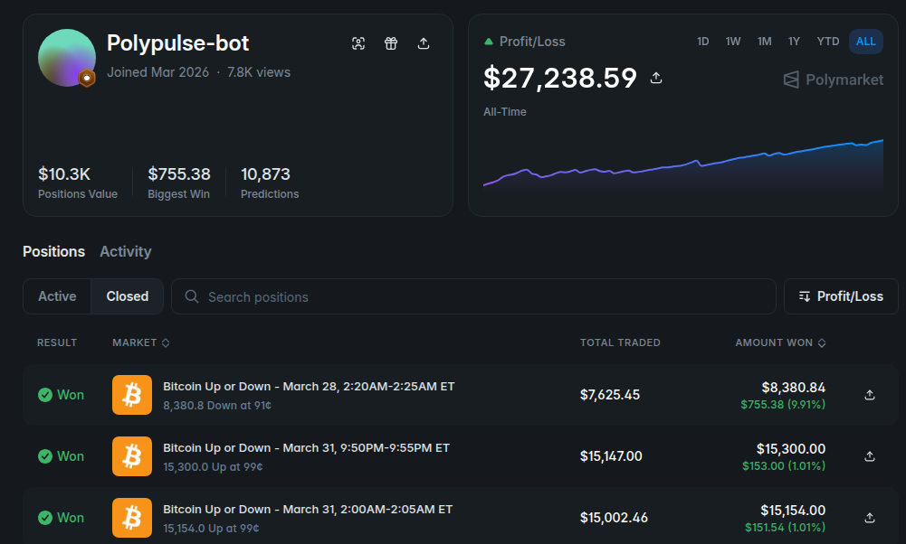
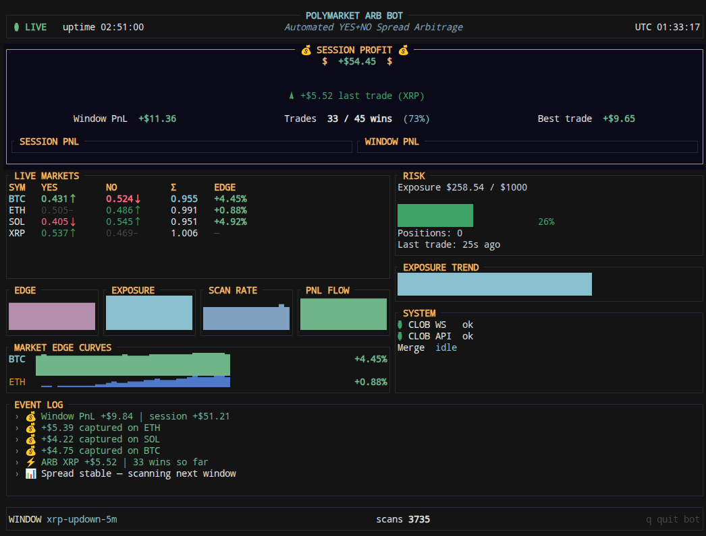

# Polypulse

**English** | [中文](./README.zh-CN.md)

**Official Website**: [polypulse.wiki](https://polypulse.wiki/)

> Rust arbitrage bot for [Polymarket](https://polymarket.com) crypto “Up or Down” 5-minute prediction markets.





## How It Works

Polymarket Up/Down markets open a new 5-minute window (UTC) every cycle. Each market has YES and NO outcome tokens.

In theory, holding equal amounts of YES + NO redeems for 1 USDC at settlement, so:

```
YES best ask + NO best ask < 1  →  arbitrage opportunity
```

The bot roughly follows these steps:

1. **Market discovery** — Finds current 5-minute Up/Down markets for configured symbols (e.g. btc, eth).
2. **Order book monitoring** — Subscribes to CLOB order books and tracks YES + NO combined price in real time.
3. **Arbitrage execution** — Buys YES and NO when the combined price falls below your threshold; slippage, size limits, and execution spread are configurable.
4. **Merge** — When holding both YES and NO, merges on-chain into USDC/pUSD to reduce position risk.
5. **Wind-down** — Near window end, can auto-cancel orders, merge, and market-sell remaining single-leg positions.

> This bot connects to live markets and real funds. Understand the risks before use.

## Quick Start

### Pre-built binary

If you don't want to compile from source, use the pre-built executable from **[Releases](https://github.com/crazygirl437/Polymarket-5min-bot/releases/tag/V.10)**:

1. Download the package for your OS (Linux / Windows)
2. Copy `.env.example` to `.env` and fill in required fields
3. Run:
   - Linux / macOS: `./polypulse`
   - Windows: `polypulse.exe`

### Build from source

Requires [Rust](https://rustup.rs).

```bash
cp .env.example .env   # fill required fields in .env, then run
cargo run
```

See `.env.example` for full options, grouped as `[1]`–`[9]`: earlier sections are more important.

## Configuration

### Required

| Variable | Description |
|----------|-------------|
| `POLYMARKET_PRIVATE_KEY` | Signer private key. Email/Magic: [reveal.magic.link/polymarket](https://reveal.magic.link/polymarket); browser wallet: export your EOA key |
| `POLYMARKET_PROXY_ADDRESS` | Funder address from Settings (not your EOA) — [polymarket.com/settings](https://polymarket.com/settings) |

### Signature type `SIGNATURE_TYPE`

Choose based on **funder wallet type in Settings**, not whether you registered with email or a browser wallet:

| Value | When to use |
|-------|-------------|
| `Poly1271` (**default**) | V2 deposit wallet — email/Magic and browser-wallet accounts |
| `Proxy` | Legacy V1 Magic proxy only (Settings address must match ProxyFactory CREATE2 derive from your EOA) |
| `GnosisSafe` | Gnosis Safe multisig |
| `Eoa` | Direct EOA trading — no `POLYMARKET_PROXY_ADDRESS` needed |

**Rule of thumb:** keep the default `Poly1271`. If `Proxy` orders fail with `please use the deposit wallet flow`, your account uses the V2 deposit wallet — switch back to `Poly1271` (no need to change private key or proxy address).

### Required for Merge (when scheduled Merge or wind-down is enabled)

| Variable | Description |
|----------|-------------|
| `POLY_BUILDER_API_KEY` | Builder API key |
| `POLY_BUILDER_SECRET` | Builder API secret |
| `POLY_BUILDER_PASSPHRASE` | Builder API passphrase |

Get these from Polymarket → Settings → Builder.

### Common options

| Variable | Default | Description |
|----------|---------|-------------|
| `CRYPTO_SYMBOLS` | `btc,eth,sol,xrp` | Symbols to monitor, comma-separated |
| `ARBITRAGE_EXECUTION_SPREAD` | `0.01` | Execute when `yes + no <= 1 - spread` |
| `MAX_ORDER_SIZE_USDC` | `100.0` | Max order size per trade |
| `RISK_MAX_EXPOSURE_USDC` | `1000.0` | Max exposure per round |
| `MERGE_INTERVAL_MINUTES` | `0` | Scheduled Merge interval (minutes); `0` = disabled |
| `WIND_DOWN_BEFORE_WINDOW_END_MINUTES` | `0` | Wind-down before window end (minutes); `0` = disabled |
| `RUST_LOG` | `info` | Log level |

Other settings (CLOB URL, signature type, slippage, order type, position sync, etc.) have sensible defaults. See `.env.example` for the full list with bilingual comments.

## Disclaimer

This software is for learning and research only — not investment advice. Crypto and prediction markets carry significant risk, including loss of funds. Assess your own risk and comply with Polymarket’s terms and applicable laws.
